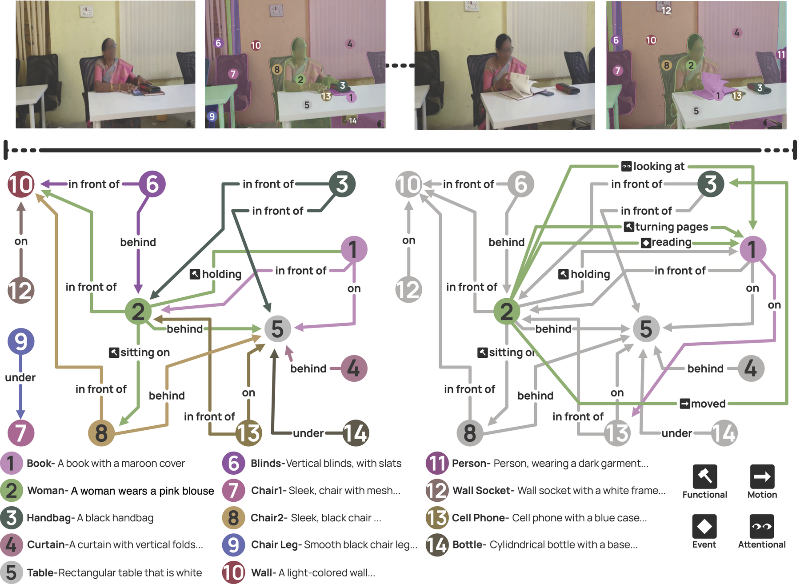

<div align="center">

# [ECCV 2026] Synthetic Visual Genome 2

### Official implementation of *Synthetic Visual Genome 2: Extracting Large-scale Spatio-Temporal Scene Graphs from Videos* (ECCV 2026)

[Ziqi Gao](https://uwgzq.github.io), 
[Jieyu Zhang](https://jieyuz2.github.io), 
[Wisdom O. Ikezogwo](https://wisdomikezogwo.github.io), 
[Jae Sung Park](https://jaesungpark96.github.io), 
[Tario You](https://www.linkedin.com/in/tario-you), 
[Daniel Ogbu](https://www.linkedin.com/in/deogbu), 
[Chenhao Zheng](https://hellomuffin.github.io/), 
[Weikai Huang](https://weikaih04.github.io/), 
[Yinuo Yang](https://www.linkedin.com/in/yinuo-yang-54114821a), 
[Winson Han](https://www.winsonhan.com/), 
[Quan Kong](https://quan-kong.github.io/homepage/), 
[Rajat Saini](https://jp.linkedin.com/in/rajat-saini), 
[Ranjay Krishna](https://www.ranjaykrishna.com)

Allen Institute for AI · University of Washington · Woven by Toyota · Microsoft

[](https://arxiv.org/abs/2602.23543)
[](https://uwgzq.github.io/papers/SVG2/)
[](https://huggingface.co/UWGZQ/TRASER)
[](https://huggingface.co/datasets/UWGZQ/Synthetic_Visual_Genome2)
[](LICENSE)



</div>

**Synthetic Visual Genome 2 (SVG2)** is a panoptic video scene graph dataset of **636K videos** with **6.6M** object
trajectories, **52.0M** attributes and **6.7M** relations — an order of magnitude larger and
more diverse than prior spatio-temporal scene graph datasets. It is built by a fully
automated pipeline: multi-scale panoptic segmentation, online–offline trajectory tracking
with automatic new-object discovery, per-trajectory semantic parsing, and GPT-5-based
spatio-temporal relation inference. Manual evaluation of sampled annotations yields 93.8%
accuracy for objects, 88.3% for attributes and 85.4% for relations.

**TRASER** is the video scene graph generation model trained on SVG2. Given a video and its
panoptic object trajectories, it first arranges the visual tokens by trajectory — one block
per object, split into temporal windows — and then aggregates each block with two Perceiver
resamplers: an object-trajectory resampler that summarises the whole trajectory, and a
temporal-window resampler that keeps the fine-grained motion inside each window. The
arranged sequence is decoded into a spatio-temporal scene graph in a single forward pass.

This repository contains the annotation pipeline that produced SVG2 ([`pipeline/`](pipeline)),
the TRASER training code ([`traser/`](traser)) and inference with the released checkpoint
([`traser/inference.py`](traser/inference.py)).

## News

* **2026-09-06** — Released the human-verified [`SVG2_test`](https://huggingface.co/datasets/UWGZQ/Synthetic_Visual_Genome2).
* **2026-09-05** — Released the annotation pipeline and the TRASER training and inference code.
* **2026-07-23** — SVG2 was accepted to ECCV 2026.
* **2026-02-17** — Released the [TRASER](https://huggingface.co/UWGZQ/TRASER) and [SVG2](https://huggingface.co/datasets/UWGZQ/Synthetic_Visual_Genome2).


## Contents

| | |
|---|---|
| [Installation](#installation) | environment setup |
| [Inference](#inference) | video + object trajectories → scene graph, with a worked example |
| [Annotation pipeline](#annotation-pipeline) | the six stages that produced SVG2 |
| [Training](#training) | reproducing TRASER from the released data |
| [Results](#results) | benchmark results |
| [`docs/`](docs) | [PIPELINE](docs/PIPELINE.md) · [DATA](docs/DATA.md) · [TRAINING](docs/TRAINING.md) · [INFERENCE](docs/INFERENCE.md) |

## Installation

Python 3.11 and a
CUDA GPU are required.

```bash
git clone https://github.com/uwGZQ/Synthetic_Visual_Genome_2.git
cd Synthetic_Visual_Genome_2
conda create -n svg2 python=3.11 -y && conda activate svg2

# 1. torch, from the index matching your CUDA driver (cu128 shown)
pip install torch==2.8.0 torchvision==0.23.0 --index-url https://download.pytorch.org/whl/cu128

# 2. everything else (SAM2_BUILD_CUDA=0 skips sam2's optional native extension)
SAM2_BUILD_CUDA=0 pip install -r requirements.txt

# 3. the pipeline's captioner — keep --no-deps, its dependency list would replace transformers
pip install --no-deps git+https://github.com/NVlabs/describe-anything.git

# 4. flash-attn, needed for training only
pip install 'flash-attn==2.8.3.post1+cu.12.8.torch.2.8' --extra-index-url https://wheels.astral.sh/simple/cu128/

export OPENAI_API_KEY=sk-...        # annotation pipeline, stages 5 and 6
```

Model weights download from the Hugging Face Hub on first use; set `HF_HOME` to relocate the
cache. All commands below are run from the repository root.

## Inference

TRASER takes a video **and** its per-object mask trajectories, and emits the scene graph as
JSON:

```bash
python traser/inference.py --video clip.mp4 --masks clip_rle.json
```

`--masks` is a per-frame, per-object COCO RLE JSON — the format `traser/data/prepare_svg2.py`
writes and the released dataset uses.

**Worked example.** The model repository ships a video with its trajectory masks:

```bash
hf download UWGZQ/TRASER --include "example/*" --local-dir traser/examples
python traser/inference.py \
    --video traser/examples/example/2401075277.mp4 \
    --masks traser/examples/example/2401075277_rle.json \
    --output traser/examples/2401075277.scene_graph.json
```

The expected result is [`traser/examples/2401075277.reference.json`](traser/examples/2401075277.reference.json)
(9 objects with attributes, 22 timed relationships; produced with the environment above on an
A100 — decoding is greedy, so the same environment reproduces it exactly).

If you only have a video, run the annotation pipeline first and feed its scene graph in
directly:

```bash
python pipeline/svg2_pipeline.py --video clip.mp4 --output-dir outputs/
python traser/inference.py --video clip.mp4 \
    --masks outputs/clip/stage6_scene_graph.json --from_scene_graph
```

`--task` selects any of the four prompts the model was trained with (`scene_graph`,
`relationships`, `attributes`, `objects`). See [docs/INFERENCE.md](docs/INFERENCE.md) for the
output format and the inference options.

## Annotation pipeline

`pipeline/svg2_pipeline.py` is the pipeline that produced SVG2. Six stages turn one video into
a scene graph:

| # | Stage | Model |
|---|-------|-------|
| 1 | Class-agnostic "segment everything" on sampled frames | SAM 2 automatic mask generator |
| 2 | Track masks through the video, re-discovering new objects | SAM 2 video predictor |
| 3 | De-duplicate and clean the trajectories | — |
| 4 | Describe each object from its frames + masks | DAM-3B-Video |
| 5 | Parse each description into name / attributes / relationships / actions | OpenAI API |
| 6 | Infer temporal + spatial relations between objects | OpenAI vision API |

```bash
python pipeline/svg2_pipeline.py --video pipeline/examples/sav_000001.mp4 --output-dir outputs/ \
    --config pipeline/examples/run_full.yaml       # the settings SVG2 was built with
```

Any stage range can be run on its own (`--start-stage` / `--end-stage`), so stages 1–3 work
without an API key. [docs/PIPELINE.md](docs/PIPELINE.md) documents every stage, the
configuration system and each artifact.

## Training

Training uses all seven SVG2 splits. Download the annotations and masks, download the videos
from their original sources, and convert **every** split into the training format — one
`prepare_svg2.py` call per split, all listed in [docs/DATA.md](docs/DATA.md):

```bash
python traser/data/prepare_svg2.py --source vidvrd --svg2_root SVG2 \
    --video_root /path/to/vidvrd-videos --out_dir traser/data
# ... and likewise for sav, pvd, vipseg, vidor, lvvis, ovis

bash traser/scripts/train.sh                     # 8 GPUs, DeepSpeed ZeRO-3, the released recipe
```

`train.sh` fails if any of the seven annotation files is missing. To try the code on a single
split before preparing the full mixture:

```bash
DATASETS=vidvrd NUM_GPUS=1 bash traser/scripts/train.sh
```

[docs/TRAINING.md](docs/TRAINING.md) covers the architecture, the launcher's environment
variables and the key training arguments.

## Results

Video scene graph generation from panoptic object trajectories, under the lenient semantic
criterion with a temporal IoU threshold of 0.5 (Table 2 of the paper). SVG2<sub>test</sub> is
the human-verified `SVG2_test` split of the
[dataset](https://huggingface.co/datasets/UWGZQ/Synthetic_Visual_Genome2).

**Triplet and relation recall**

| Model | Triplet PVSG | Triplet VidOR | Triplet SVG2<sub>test</sub> | Relation PVSG | Relation VidOR | Relation SVG2<sub>test</sub> |
|---|---:|---:|---:|---:|---:|---:|
| Qwen2.5-VL-3B | 0.1 | 0.2 | 0.2 | 0.1 | 0.4 | 0.3 |
| MiniCPM-V 4.5 | 0.1 | 3.0 | 1.1 | 0.2 | 4.0 | 2.4 |
| FT-Qwen2.5-VL-3B (bbox traj.) | 0.5 | 1.8 | 1.4 | 1.6 | 4.2 | 3.0 |
| GPT-5 | **16.6** | 19.7 | **17.9** | **18.3** | 21.7 | **19.4** |
| **TRASER** | 16.1 | **22.9** | 16.7 | 16.9 | **25.0** | 18.7 |

**Object accuracy and attribute recall**

| Model | Object VIPSeg | Object PVSG | Object VidOR | Object SVG2<sub>test</sub> | Attribute SVG2<sub>test</sub> |
|---|---:|---:|---:|---:|---:|
| Qwen2.5-VL-3B | 22.1 | 10.4 | 45.0 | 24.2 | 1.4 |
| MiniCPM-V 4.5 | 40.0 | 14.3 | 59.1 | 38.5 | 8.4 |
| FT-Qwen2.5-VL-3B (bbox traj.) | 35.1 | 33.6 | 56.9 | 46.1 | 13.4 |
| GPT-5 | 68.1 | 54.2 | 88.5 | 65.5 | 24.1 |
| **TRASER** | **86.5** | **72.7** | **91.4** | **79.0** | **27.1** |

TRASER has the best average rank of the twelve models compared. See the
[paper](https://arxiv.org/abs/2602.23543) for the full comparison, the strict criterion, the
ablations, and the downstream video question answering results.

## Repository structure

```
Synthetic_Visual_Genome_2/
├── requirements.txt
├── pipeline/                     # SVG2 annotation pipeline
│   ├── svg2_pipeline.py          #   the six stages
│   ├── configs/default.yaml      #   every option with its default
│   └── examples/                 #   run_full.yaml (the SVG2 settings) + a sample video
├── traser/                       # TRASER training + inference
│   ├── inference.py              #   CLI: video + mask trajectories -> scene graph
│   ├── examples/                 #   reference output for the worked example
│   ├── scripts/train.sh          #   training launcher (DeepSpeed ZeRO-3)
│   ├── traser_train/
│   │   ├── train/                #     model, trainer, token selection + arrangement
│   │   └── data/                 #     dataset registry, video + trajectory dataset
│   └── data/prepare_svg2.py      #   released SVG2 parquets -> training format
├── docs/                         # PIPELINE, DATA, TRAINING, INFERENCE
└── assets/                       # figures
```

## License

The code in this repository is released under the [Apache 2.0 License](LICENSE). SVG2 is
built on top of existing video datasets whose licenses vary by source; see the
[dataset card](https://huggingface.co/datasets/UWGZQ/Synthetic_Visual_Genome2) for details.

## Citation

```bibtex
@misc{gao2026syntheticvisualgenome2,
      title   = {Synthetic Visual Genome 2: Extracting Large-scale Spatio-Temporal Scene Graphs from Videos},
      author  = {Ziqi Gao and Jieyu Zhang and Wisdom Oluchi Ikezogwo and Jae Sung Park and Tario G. You and Daniel Ogbu and Chenhao Zheng and Weikai Huang and Yinuo Yang and Winson Han and Quan Kong and Rajat Saini and Ranjay Krishna},
      year    = {2026},
      eprint  = {2602.23543},
      archivePrefix = {arXiv},
      primaryClass  = {cs.CV},
      url     = {https://arxiv.org/abs/2602.23543}
}
```

## Acknowledgements

The annotation pipeline builds on [SAM 2](https://github.com/facebookresearch/sam2) and
NVIDIA's [Describe Anything](https://github.com/NVlabs/describe-anything); TRASER builds on
[Qwen2.5-VL](https://huggingface.co/Qwen/Qwen2.5-VL-3B-Instruct) and its
[fine-tuning code](https://github.com/QwenLM/Qwen2.5-VL).
