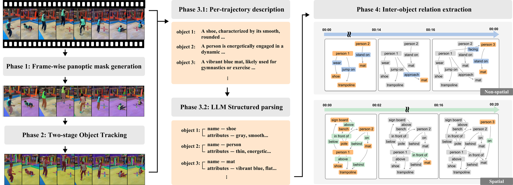

# The SVG2 annotation pipeline

`pipeline/svg2_pipeline.py` turns a single video into a video scene graph: for every
salient object it produces a mask **trajectory** across the clip together with a structured
record — the object's **name**, **attributes**, **relationships** and **actions**, the
description it was derived from — plus the **temporal** and **spatial** relationships
between objects. This is the pipeline that produced SVG2.

The whole pipeline is one file and runs locally from a video path. All model weights are
downloaded from the Hugging Face Hub on first use.



## Stages

| # | Stage | What it does | Model |
|---|-------|--------------|-------|
| 1 | `maskgen` | "Segment everything" on sampled frames, kept as the maximum non-overlapping set | **SAM 2** (`SAM2AutomaticMaskGenerator`, multi-scale point grid) |
| 2 | `track` | Propagate seed masks through the video; re-discover objects that appear mid-clip (two-pass) | **SAM 2** video predictor |
| 3 | `cleanup` | De-duplicate contained/near-identical tracks; morphological open of each mask | — (CPU) |
| 4 | `caption` | Describe the largest objects from sampled frames + masks | **DAM-3B-Video** (NVIDIA Describe-Anything) |
| 5 | `structure` | Turn each description into `{Object, Attributes, Relationships, Actions}` | **OpenAI** API (`gpt-5-mini` by default) |
| 6 | `relationships` | Extract **temporal** + **spatial** relationships between the named objects | **OpenAI** vision API (2 calls/video) |

**Relationships (stage 6).** Two vision calls per video — one temporal (non-spatial, with a
relationship-type taxonomy) and one spatial — each given the frames sampled at ~1 fps plus,
per frame, the named objects and their bounding boxes. Output is a list of tuples
`[subject_id, predicate, object_id, [[start,end],...] (, type)]` whose intervals index
`relationships.sampled_frame_indices`. Toggle with `--no-temporal` / `--no-spatial`.


## Installation

See the [repository README](../README.md#installation). Stages 5 and 6 additionally need
`OPENAI_API_KEY`.

The first run downloads the SAM 2 weights and DAM-3B-Video (~6 GB) into the Hugging Face cache
(`HF_HOME`, which the pipeline defaults to `pipeline/.cache/hf`; `--cache-dir` relocates it).

## Usage

All commands run from the repository root.

```bash
# Full pipeline
python pipeline/svg2_pipeline.py --video clip.mp4 --output-dir outputs/ \
    --planning-goal "place the red block in the bowl"

# Stages 1-3 only (no captioner or API key needed), fast settings with the tiny SAM 2 model
python pipeline/svg2_pipeline.py --video clip.mp4 --output-dir outputs/ \
    --maskgen-model-id facebook/sam2.1-hiera-tiny \
    --tracking-model-id facebook/sam2.1-hiera-tiny --start-stage 1 --end-stage 3

# Resume: captioning onward, from a previous run's stage-3 artifact
python pipeline/svg2_pipeline.py --video clip.mp4 --output-dir outputs/ --start-stage 4

# The settings used to build SVG2, on the bundled sample video
python pipeline/svg2_pipeline.py --video pipeline/examples/sav_000001.mp4 --output-dir outputs/ \
    --config pipeline/examples/run_full.yaml
```

### Configuration

Every model id and hyperparameter is a documented, defaulted field grouped by stage
(`IOConfig`, `RuntimeConfig`, `MaskGenConfig`, `TrackingConfig`, `CleanupConfig`,
`CaptionConfig`, `StructureConfig`). Configure a run three ways, in increasing precedence:

1. a YAML/JSON config file: `--config my_config.yaml`
2. CLI flags (`--help`) for the common options
3. `--dump-config config.yaml` writes out the effective config to start from

Key controls:

- **Start/end stage** — `--start-stage` / `--end-stage` (stage name or `1`–`6`).
- **Per-stage saving** — `--save-stages 1,2,3`, or `--no-save-intermediate` for only the
  final artifact. The end-stage artifact is always written.
- **Paths** — `--video`, `--output-dir`, `--cache-dir`.
- **Planning goal** — `--planning-goal` or `--planning-goal-json` is required
  through stage 6. After native tracking and object structuring, it selects only
  `robot`, `manipulated_object`, `initial_support`, and `target` tracks. Relation
  inference receives this induced subgraph only.
- **Models** — `--maskgen-model-id`, `--tracking-model-id`, `--caption-model-id`,
  `--structure-model-id`, `--relationship-model-id`.
- **Relationships** — `--relationship-fps`, `--relationship-max-frames`, `--no-temporal`,
  `--no-spatial`.

## Outputs

Artifacts are written under `<output_dir>/<video_stem>/`:

| File | Contents |
|------|----------|
| `stage1_masks.json` | Per-sampled-frame class-agnostic masks (RLE) |
| `stage2_tracks.json` | Per-object mask trajectory (RLE per frame) |
| `stage3_tracks_clean.json` | De-duplicated, cleaned trajectories |
| `stage4_descriptions.json` | Per-object free-form description |
| `stage5_scene_graph.json` | Objects + names/attributes/relationships/actions |
| `stage6_scene_graph.json` | **Final** — stage 5 plus inter-object temporal/spatial relationships |

The per-object part of the final artifact:

```json
{
  "video": "...", "height": 1280, "width": 720, "total_frames": 285,
  "objects": [
    {
      "object_id": 0,
      "name": "apple",
      "attributes": ["red", "shiny", "round", "smooth"],
      "relationships": ["resting on wooden table", "next to knife"],
      "actions": ["stationary"],
      "description": "A shiny red apple ...",
      "trajectory": {
        "first_frame": 0,
        "frames": [0, 1, 2, "..."],
        "boxes": {"0": ["x1", "y1", "x2", "y2"]},
        "masks": [{"size": ["H", "W"], "counts": "..."}, null]
      }
    }
  ]
}
```

Masks are COCO RLE (`pycocotools`); `boxes` are `[x1, y1, x2, y2]`; `masks` is per-frame
(`null` where the object is absent).

`stage6_scene_graph.json` adds a top-level `relationships` block:

```json
"relationships": {
  "sampled_frame_indices": [0, 24, 48],
  "temporal": [[1, "stands on", 3, [[0, 20]], "stateful"]],
  "spatial":  [[0, "on", 3, [[0, 20]]]]
}
```

Each tuple is `[subject_id, predicate, object_id, [[start,end],...]]`, with an extra
relationship type as a 5th element for temporal edges. `start`/`end` index
`sampled_frame_indices` (so `[0,20]` covers original frames `0..480` at 1 fps).
`subject_id`/`object_id` may be `-1` for the camera.

Because the trajectories in `stage6_scene_graph.json` are per-frame RLE masks, the pipeline
output can be fed straight to TRASER:

```bash
python traser/inference.py --video clip.mp4 \
    --masks outputs/clip/stage6_scene_graph.json --from_scene_graph
```
