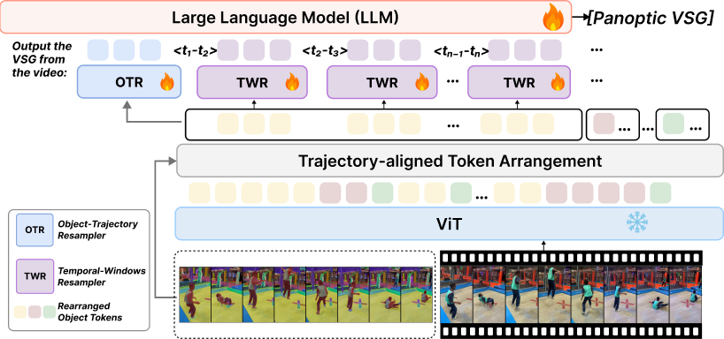

# Training TRASER

TRASER extends **Qwen2.5-VL-3B-Instruct** with *trajectory-aligned token arrangement* followed
by two Perceiver resamplers. Given the video tokens and one segmentation trajectory per object,
the sequence is first rearranged so that every object gets its own block, sub-divided into
temporal windows; the two resamplers then aggregate the arranged tokens:

| Module | Abbrev. | Attribute in the checkpoint | Role |
|---|---|---|---|
| Object-Trajectory Resampler | **OTR** | `second_perceiver_resampler` | Aggregates all of one object's tokens across the whole trajectory into a global summary |
| Temporal-Window Resampler | **TWR** | `perceiver_resampler` | Compresses one object's tokens inside each temporal window into a fixed set of latents |



Each object's visual tokens are selected from its segmentation masks by mask coverage
(`token_selection.py`), and the input sequence is rebuilt with one block per object
(`token_arrangement.py`):

```
<obj_traj_start>  Object k:  <|vision_start|>
  [OTR latents]
  <t0 - t1 sec>  [TWR latents]
  <t1 - t2 sec>  [TWR latents]
  ...
<|vision_end|>  <obj_traj_end>
```

Objects whose masks are empty on all sampled frames are dropped, the surviving objects are
renumbered contiguously (`Object 1`, `Object 2`, …), and the assistant target — including
relationship triplets — is remapped to match. Camera/observer relationships (id `-1`) are
preserved through that remapping.

## Installation

See the [repository README](../README.md#installation). Training needs both `deepspeed` and
`flash-attn`, so do not skip step 4.

## Data

See [DATA.md](DATA.md) for downloading SVG2 and converting it into
`traser/data/<split>.json` + `traser/data/masks/<split>/`. The dataset registry
(`traser_train/data/__init__.py`) resolves annotation files relative to `traser/data`, so no
absolute paths are baked into the code.

## Run

```bash
bash traser/scripts/train.sh
```

The script fine-tunes `Qwen/Qwen2.5-VL-3B-Instruct` on 8 GPUs with DeepSpeed ZeRO-3: the LLM,
the vision–language merger and both resamplers are trainable, the vision tower is frozen.
Learning rates are 2e-5 (base), 1e-4 (resamplers) and 5e-5 (merger); one epoch, cosine
schedule, per-device batch 1 with gradient accumulation 2. It runs from any working directory.

The defaults are the released recipe: all seven splits, whose annotation files must all exist
under `traser/data/`. Environment variables override them:

| Variable | Default | Meaning |
|---|---|---|
| `DATASETS` | `svg2_sav,svg2_pvd,vipseg,vidor,vidvrd,lvvis,ovis` | Comma-separated registry names; append `%<pct>` to subsample (`svg2_pvd%10` keeps 10%) |
| `NUM_GPUS` | `8` | GPUs for `deepspeed --num_gpus` |
| `OUTPUT_DIR` | `traser/checkpoints/traser_qwen2.5vl_3b` | Checkpoint directory |
| `REPORT_TO` | `none` | `wandb` to log to Weights & Biases |
| `EXTRA_ARGS` | — | Further `TrainingArguments`, appended last (later flags win) |

```bash
# smoke test: one split, one GPU, two optimizer steps, no intermediate checkpoints
DATASETS=vidvrd NUM_GPUS=1 EXTRA_ARGS="--max_steps 2 --save_strategy no" bash traser/scripts/train.sh
```

The launcher checks that every split in `DATASETS` has its annotation file under `traser/data/`
before loading the model. Whatever the save strategy, the final weights are always written to
`OUTPUT_DIR` (about 8 GB), so point it at scratch space for throwaway runs.

### Key training arguments

Names follow the released model config on the Hub:

| Argument | Config key | Meaning |
|---|---|---|
| `--object_resampler` | `object_resampler` | Enable the OTR (global object summary) |
| `--object_resampler_n_latents` | `object_resampler_n_latents` | Latents per object for the OTR |
| `--temporal_resampler_n_latents` | `temporal_resampler_n_latents` | Latents per temporal window for the TWR |
| `--resampler_depth` | `resampler_depth` | Depth of both perceiver resamplers |
| `--temporal_window_length` | — | Temporal window length, in seconds |
| `--coverage_thresh` | — | Minimum mask coverage for a visual token to be selected |
| `--time_reduce` | — | How coverage is reduced over the frames merged into one temporal grid |
| `--resampler_lr` / `--mm_projector_lr` | — | Per-module learning rates |

The rearranged sequence is capped at `MAX_ARRANGED_SEQ_LEN = 20000` tokens
(`traser_train/train/trainer_insert.py`) to bound peak memory; longer sequences are truncated
with a warning.
